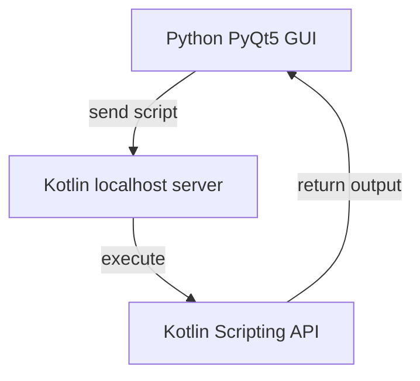

# Script Running Tool - JETBRAINS project submission

The Python GUI sends the script text to the Kotlin backend over a local TCP connection.
The server evaluates the script using the Kotlin Scripting Host API and streams console output and errors back in real-time.



~~
### Video demo:
[](https://youtu.be/HaBZ3KGebkg)

## Features
- Execute Kotlin scripts from a Python GUI
- Real-time console output streaming
- Debug mode with step-by-step execution
- Error highlighting and navigation in GUI
- TCP-based communication between client and server
- The tested script is saved in ```ScriptTool_JETBRAINS/MyScript.kts```


## Build

### Requirements

- JDK 21
- Gradle 8.3+ (or use included `gradlew`)
- Kotlin 1.9.22

### Dependencies

- Kotlin standard library
- Kotlinx Serialization JSON 1.6.3
- Kotlin Scripting API 1.9.22
- Ktor Networking 2.3.12
- Ktor TLS 2.3.12
- Kotlinx Coroutines Core 1.8.1
- Kotlin Test 1.9.22


### Python

- Python >= 3.10
- PyQt5

### Step 1:
- Create the python venv and install dependencies:
    - In the ```ScriptTool_JETBRAINS``` dir
    - Run: ```python -m venv venv```
    - Run: ```source venv/bin/activate```
    - Run: ```cd py_src; pip install -r requirements.txt```

### Step 2:
- Launch the Kotlin backend server in the IntelliJ idea app after building the Gradle project (run from the ```Main.kt``` file).

### Step 3:
- In the ```/ScriptTool_JETBRAINS/py_src``` dir, run ```python3 GUI.py``` and use the app.
